# Vlant 🏮 - Mạng xã hội ẩn danh nền tảng MERN

**Vlant** là một ứng dụng web xã hội được xây dựng trên nền tảng MERN (MongoDB, Express.js, React, Node.js), lấy cảm hứng từ hình ảnh thơ mộng của việc thả đèn trời. Ứng dụng cung cấp một không gian để người dùng chia sẻ những suy nghĩ, tâm sự của mình một cách ẩn danh, kết nối với người khác qua những cảm xúc đồng điệu, và thậm chí tìm kiếm bạn bè mới thông qua một hệ thống ghép cặp ẩn danh độc đáo.

## ✨ Các tính năng chính

- **Đăng bài ẩn danh:** Chia sẻ suy nghĩ của bạn dưới dạng những "chiếc lồng đèn" mà không tiết lộ danh tính. Người dùng có thể tùy chọn đăng bài công khai với tên thật.
- **Bảng tin (Feed):** Một luồng bài viết được cập nhật, nơi người dùng có thể xem các "lồng đèn" đang trôi nổi.
- **Tương tác:** Thích (Like), Bình luận (Comment), và Lưu (Save) những chiếc lồng đèn mà bạn tâm đắc.
- **Hệ thống Bạn bè:** Gửi, nhận và quản lý lời mời kết bạn để kết nối với những người dùng khác.
- **Nhắn tin Real-time:** Trò chuyện riêng tư (1-1) với bạn bè.
- **Ghép cặp ẩn danh:**
  - Tham gia hàng đợi để được ghép cặp ngẫu nhiên với một người dùng khác đang online.
  - Trải nghiệm một cuộc trò chuyện hoàn toàn ẩn danh trong một giao diện riêng biệt.
  - Lịch sử trò chuyện được lưu lại cho mỗi lần ghép cặp.
- **Thông báo Real-time:** Nhận thông báo tức thì cho các lượt thích, bình luận, và lời mời kết bạn thông qua Socket.IO.
- **Hồ sơ cá nhân:** Xem trang cá nhân của người dùng khác và quản lý trang của chính mình.
- **Phân quyền dựa trên vai trò:** Phân biệt rõ ràng giữa các vai trò Guest (Khách), User (Thành viên), Moderator, và Admin.
- **Xác thực an toàn:** Xác thực dựa trên JWT (JSON Web Tokens) với `httpOnly` cookie để tăng cường bảo mật.

## 🛠️ Công nghệ sử dụng

### Frontend

- **React 18+** (với Vite)
- **React Router v6** để quản lý routing
- **Redux Toolkit** để quản lý trạng thái toàn cục
- **Tailwind CSS** để tạo giao diện
- **Framer Motion** để tạo hiệu ứng chuyển động
- **Socket.IO Client** để giao tiếp real-time
- **Axios** để gửi request API
- **date-fns** để định dạng ngày tháng

### Backend

- **Node.js**
- **Express.js** làm framework cho server
- **MongoDB** với **Mongoose** làm ODM
- **Socket.IO** để giao tiếp WebSocket real-time
- **JSON Web Tokens (JWT)** để xác thực
- **bcrypt.js** để mã hóa mật khẩu
- **Multer** & **Cloudinary** để upload ảnh (sẽ được triển khai)

## 🚀 Bắt đầu

Làm theo các hướng dẫn sau để cài đặt và chạy dự án trên máy của bạn cho mục đích phát triển và thử nghiệm.

### Yêu cầu

- [Node.js](https://nodejs.org/) (phiên bản v18.x trở lên được khuyến khích)
- [Yarn](https://yarnpkg.com/)
- [MongoDB](https://www.mongodb.com/try/download/community) được cài đặt trên máy hoặc một chuỗi kết nối MongoDB Atlas.

### Cài đặt & Thiết lập

1.  **Clone repository về máy:**

    ```bash
    git clone https://github.com/your-username/vlant-app.git
    cd vlant-app
    ```

2.  **Thiết lập Backend:**

    ```bash
    # Di chuyển đến thư mục backend
    cd backend

    # Cài đặt các gói phụ thuộc
    yarn install

    # Tạo một file .env trong thư mục /backend
    # và thêm các biến môi trường sau:
    ```

    **File: `backend/.env`**

    ```env
    PORT=5000
    MONGO_URI=your_mongodb_connection_string
    JWT_SECRET=your_super_secret_key_for_jwt
    CLIENT_URL=http://localhost:3000
    ```

3.  **Thiết lập Frontend:**

    ```bash
    # Từ thư mục gốc, di chuyển đến thư mục frontend
    cd ../frontend

    # Cài đặt các gói phụ thuộc
    yarn install

    # Tạo một file .env trong thư mục /frontend
    # (Vite yêu cầu các biến môi trường phải có tiền tố VITE_)
    ```

    **File: `frontend/.env`**

    ```env
    VITE_API_URL=http://localhost:5000
    ```

### Chạy ứng dụng

Bạn sẽ cần mở hai cửa sổ terminal riêng biệt để chạy đồng thời cả server frontend và backend.

1.  **Chạy Backend Server:**

    ```bash
    # Trong thư mục /backend
    yarn dev
    ```

    Server backend của bạn sẽ chạy tại `http://localhost:5000`.

2.  **Chạy Frontend Development Server:**
    ```bash
    # Trong thư mục /frontend
    yarn dev
    ```
    Ứng dụng frontend của bạn sẽ có thể truy cập tại `http://localhost:3000`.

## 🎬 Hướng dẫn Demo

Đây là cách để trải nghiệm đầy đủ các tính năng của Vlant:

#### 1. Đăng ký và Đăng nhập

- Mở `http://localhost:3000`.
- Sử dụng form trong popup để tạo hai tài khoản khác nhau (ví dụ: `userA` và `userB`).
  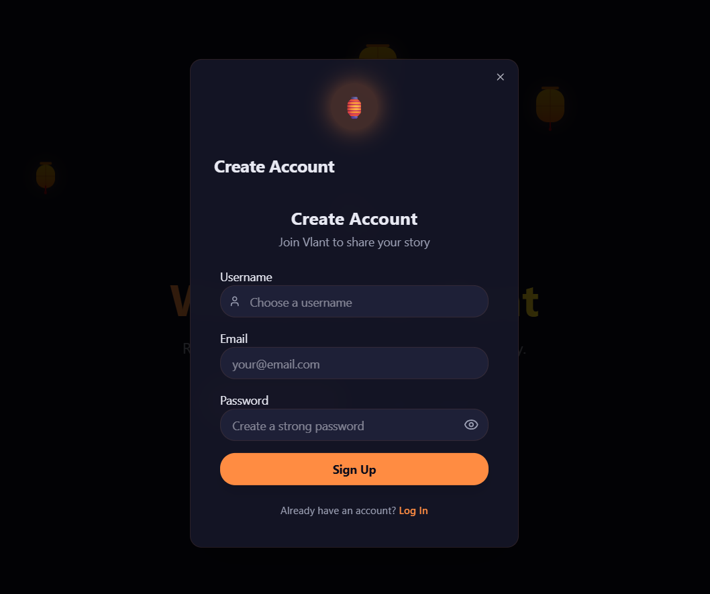
- Đăng nhập bằng `userA` trong một cửa sổ trình duyệt (ví dụ: Chrome).
  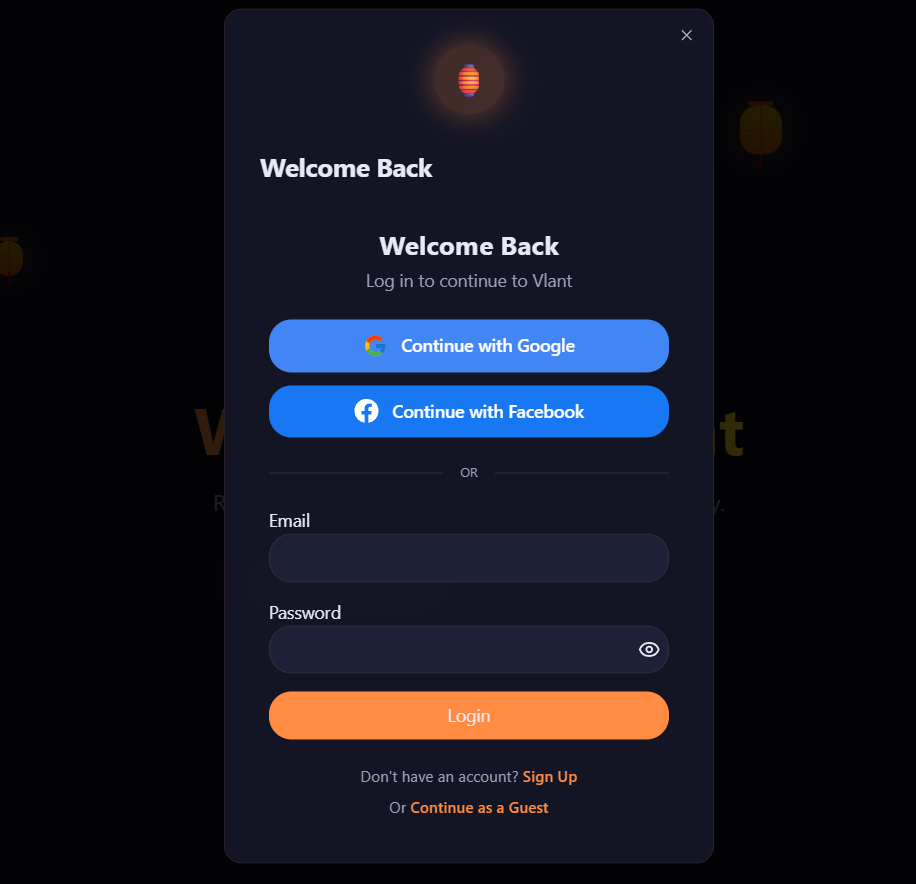
- Mở một cửa sổ ẩn danh (hoặc một trình duyệt khác) và đăng nhập bằng `userB`.
- Hoặc bạn có thể đăng nhập với khách và không cần tạo tài khoản, nhưng chỉ giới hạn chỉ xem được post feed

#### 2. Tạo một bài viết (Lồng đèn)

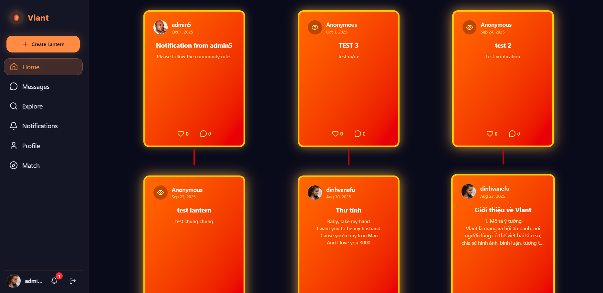

- Với tư cách `userA`, nhấn nút "Create Lantern" trên thanh sidebar.
- Một modal hình lồng đèn sẽ xuất hiện.
  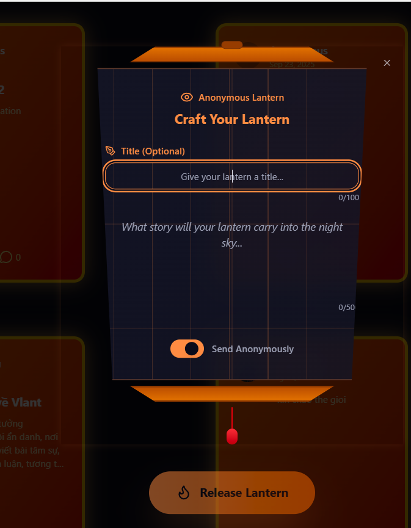
- Viết suy nghĩ của bạn, chọn đăng ẩn danh hoặc công khai.
- Nhấn "Light Your Lantern" để đăng bài. Bài viết mới sẽ xuất hiện ở đầu trang feed.
  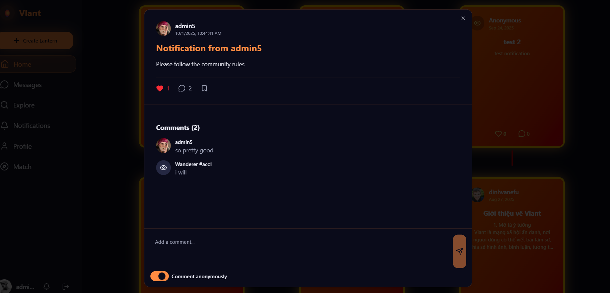

#### 3. Hệ thống Bạn bè & Thông báo

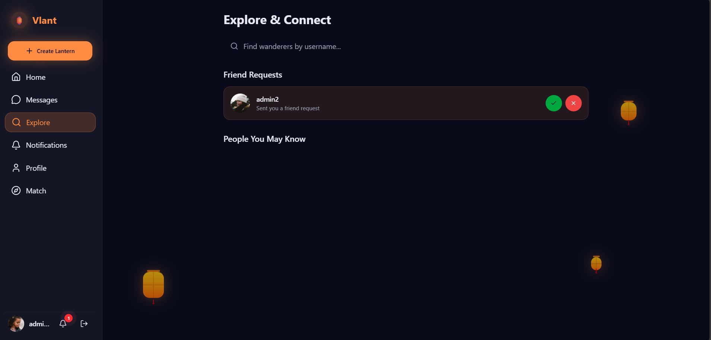

- Với tư cách `userA`, vào trang "Explore".
- Tìm kiếm username của `userB`.
- Nhấn "Add" để gửi lời mời kết bạn.
- **Chuyển sang cửa sổ của `userB`:** Bạn sẽ thấy một chỉ báo thông báo trên icon chuông gần như ngay lập tức.
  
  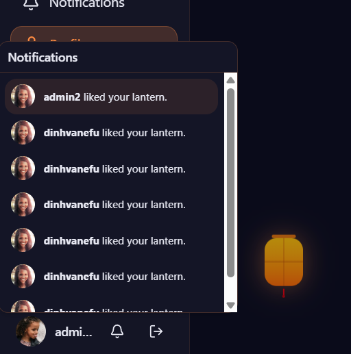
- Nhấn vào icon chuông để xem lời mời trong popover, hoặc vào trang "Notifications" và chuyển sang tab "Friend Requests".
- Nhấn "Accept".
- Bây giờ, khi xem profile của nhau, trạng thái sẽ là "Friends".
  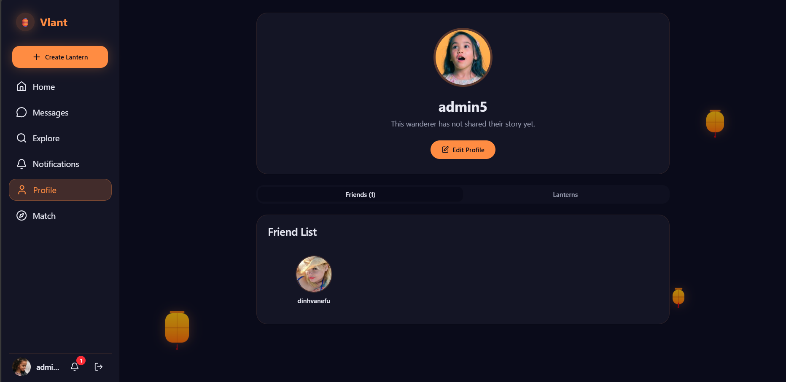
- Có thể nhắn tin giữa bạn bè với nhau
  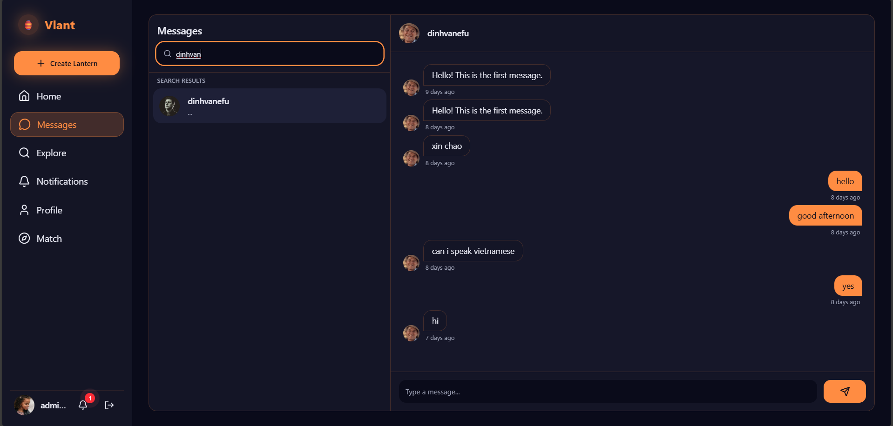

#### 4. Ghép cặp ẩn danh

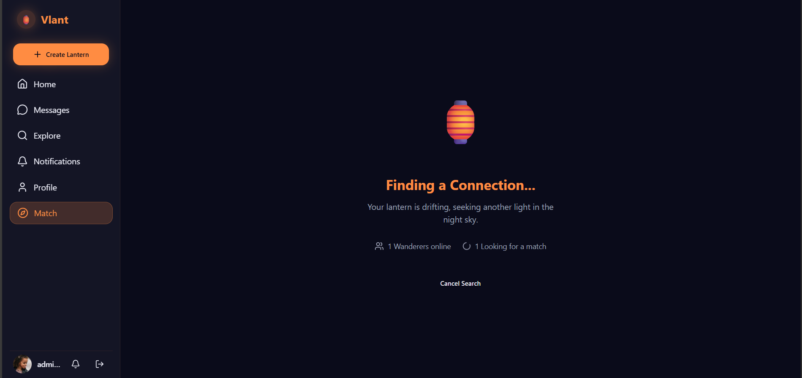

- Với tư cách `userA`, vào trang "Match" và nhấn "Start Searching". Bạn sẽ được đưa vào hàng đợi.
- **Nhanh chóng chuyển sang cửa sổ của `userB`:** Làm tương tự.
- Khi cả hai đã ở trong hàng đợi, backend sẽ ghép cặp bạn. Cả hai trình duyệt sẽ tự động được điều hướng đến trang `/anonymous-chat`.
  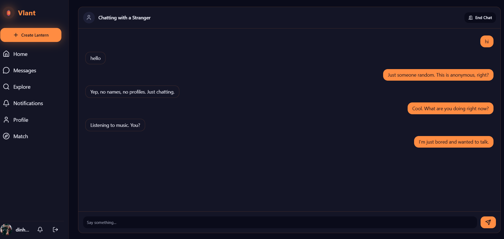
- Bây giờ bạn có thể trò chuyện với nhau dưới danh nghĩa "Stranger". Lịch sử trò chuyện được lưu lại.
- Một trong hai người có thể nhấn "End Chat". Người còn lại sẽ nhận được thông báo và có tùy chọn tìm người mới.

## 🌳 Cấu trúc dự án

### Backend

backend/
├── node_modules/ # Thư mục chứa các thư viện đã cài đặt
├── src/ # Thư mục chứa toàn bộ mã nguồn của server
│ ├── config/
│ │ └── db.js # Logic kết nối đến MongoDB
│ │
│ ├── controllers/
│ │ ├── auth.controller.js # Logic xử lý Đăng ký, Đăng nhập, Đăng xuất
│ │ ├── user.controller.js # Logic xử lý Profile, Bạn bè, Tìm kiếm
│ │ ├── post.controller.js # Logic xử lý Bài viết, Like, Comment
│ │ ├── message.controller.js # Logic xử lý Tin nhắn
│ │ └── notification.controller.js # Logic xử lý Thông báo
│ │
│ ├── middleware/
│ │ ├── auth.middleware.js # Middleware `protect` để xác thực JWT
│ │ └── error.middleware.js # Middleware xử lý lỗi (errorHandler, notFound)
│ │
│ ├── models/
│ │ ├── User.model.js # Schema cho người dùng
│ │ ├── Post.model.js # Schema cho bài viết (lồng đèn)
│ │ ├── Comment.model.js # Schema cho bình luận
│ │ ├── Conversation.model.js # Schema cho cuộc trò chuyện
│ │ ├── Message.model.js # Schema cho tin nhắn
│ │ └── Notification.model.js # Schema cho thông báo
│ │
│ ├── routes/
│ │ ├── auth.routes.js # API endpoints cho /api/auth
│ │ ├── user.routes.js # API endpoints cho /api/users
│ │ ├── post.routes.js # API endpoints cho /api/posts
│ │ ├── message.routes.js # API endpoints cho /api/messages
│ │ ├── notification.routes.js # API endpoints cho /api/notifications
│ │ └── index.js # "Bộ định tuyến chính", gộp tất cả các routes lại
│ │
│ ├── socket/
│ │ └── socketHandler.js # Toàn bộ logic của Socket.IO (ghép cặp, chat real-time)
│ │
│ ├── utils/
│ │ └── generateToken.js # (Ví dụ) Các hàm tiện ích dùng chung
│ │
│ └── server.js # Điểm vào của ứng dụng, khởi tạo Express và Socket.IO
│
├── .env # File chứa các biến môi trường (cổng, chuỗi kết nối DB, khóa bí mật)
├── .gitignore # Các file và thư mục mà Git sẽ bỏ qua
├── package.json # Thông tin dự án và danh sách các dependency
└── yarn.lock # "Khóa" phiên bản của các dependency

### Frontend

frontend/
├── node_modules/
├── public/ # Các file tĩnh (favicon, logo...)
├── src/
│ ├── api/
│ │ └── axios.js # Cấu hình Axios instance mặc định
│ │
│ ├── app/
│ │ └── store.js # Cấu hình Redux store, gộp các slice
│ │
│ ├── assets/ # Chứa ảnh, icon, font...
│ │
│ ├── components/ # Các component có thể tái sử dụng trên toàn ứng dụng
│ │ ├── auth/ # Components liên quan đến xác thực
│ │ │ ├── AuthModal.jsx
│ │ │ ├── LoginForm.jsx
│ │ │ └── RegisterForm.jsx
│ │ ├── chat/ # Components cho tính năng chat
│ │ │ └── AnonymousChatWidget.jsx
│ │ ├── user/ # Components liên quan đến người dùng
│ │ │ ├── FriendCard.jsx
│ │ │ ├── FriendRequestCard.jsx
│ │ │ └── UserCard.jsx
│ │ ├── ui/ # "Thư viện" component UI cơ bản (shadcn/ui style)
│ │ │ ├── avatar.jsx
│ │ │ ├── button.jsx
│ │ │ ├── card.jsx
│ │ │ ├── dialog.jsx
│ │ │ ├── input.jsx
│ │ │ ├── popover.jsx
│ │ │ └── ... (và các file khác)
│ │ ├── CreatePostModal.jsx
│ │ ├── FloatingLantern.jsx
│ │ ├── LanternShape.jsx
│ │ ├── Notifications.jsx # Widget popover thông báo
│ │ ├── PostCard.jsx
│ │ ├── PostDetailModal.jsx
│ │ ├── PostFeed.jsx
│ │ └── Sidebar.jsx
│ │
│ ├── context/
│ │ └── SocketContext.jsx # Provider để quản lý kết nối Socket.IO
│ │
│ ├── features/ # Thư mục chứa các Redux slice
│ │ ├── auth/
│ │ │ └── authSlice.js
│ │ ├── chat/
│ │ │ └── chatSlice.js
│ │ ├── notification/
│ │ │ └── notificationSlice.js
│ │ ├── posts/
│ │ │ └── postSlice.js
│ │ ├── user/
│ │ │ └── userSlice.js
│ │ └── ui/
│ │ └── uiSlice.js
│ │
│ ├── hooks/
│ │ └── useSocket.js # (Có thể không cần nếu dùng context) Các custom hooks
│ │
│ ├── layouts/
│ │ └── MainLayout.jsx # Layout chính (có Sidebar) cho các trang đã đăng nhập
│ │
│ ├── pages/ # Các component tương ứng với một route/trang đầy đủ
│ │ ├── AnonymousChatPage.jsx
│ │ ├── ExplorePage.jsx
│ │ ├── LandingPage.jsx
│ │ ├── MatchingPage.jsx
│ │ ├── MessengerPage.jsx
│ │ ├── NotificationsPage.jsx
│ │ └── ProfilePage.jsx
│ │
│ ├── utils/
│ │ └── cn.js # Hàm tiện ích cho Tailwind classes
│ │
│ ├── App.jsx # Component gốc, quản lý routing chính
│ ├── index.css # CSS toàn cục, biến màu, animation...
│ └── main.jsx # Điểm vào của ứng dụng, thiết lập React, Router, Redux
│
├── .env # File biến môi trường cho Vite (VITE_API_URL)
├── .gitignore
├── index.html # File HTML gốc
├── package.json
├── postcss.config.js # Cấu hình PostCSS (cho Tailwind)
├── tailwind.config.js # Cấu hình Tailwind CSS
└── vite.config.js # Cấu hình Vite (proxy, port...)

## 📜 Giấy phép
